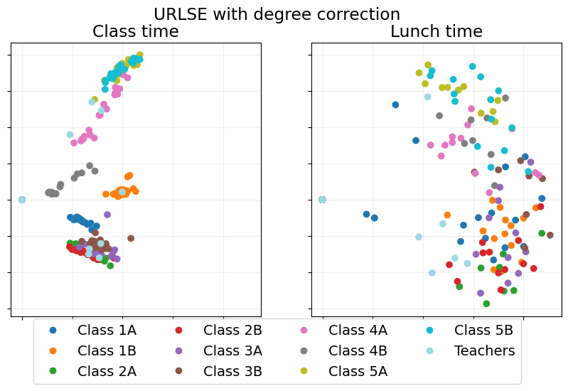
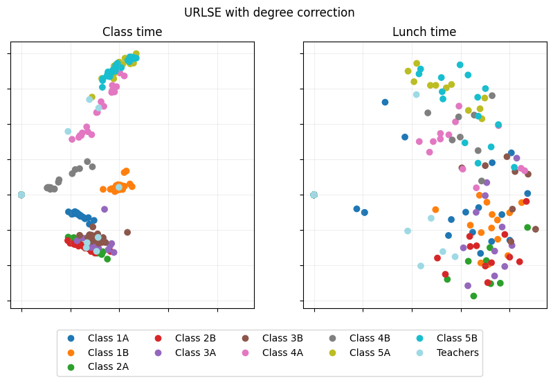
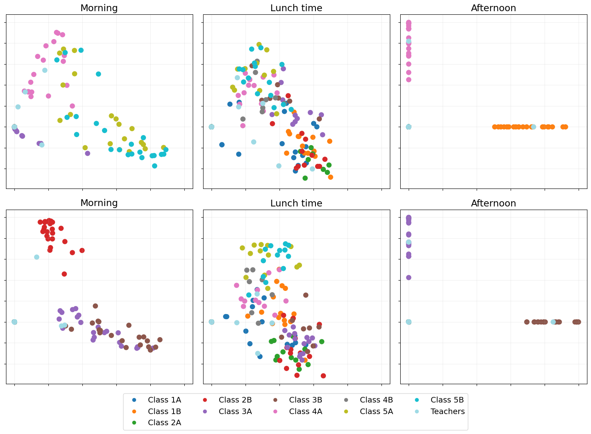
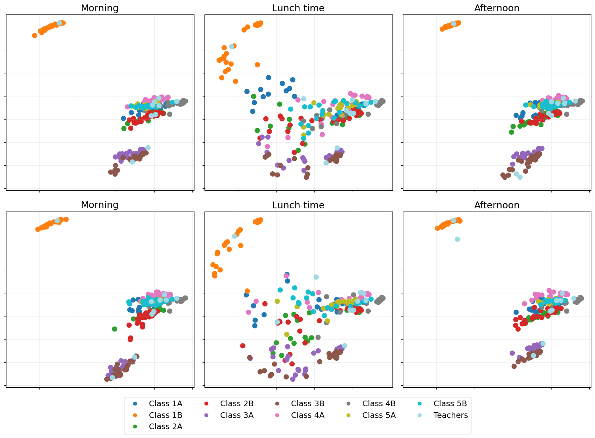
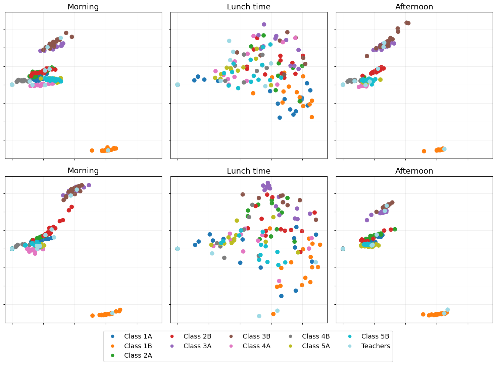
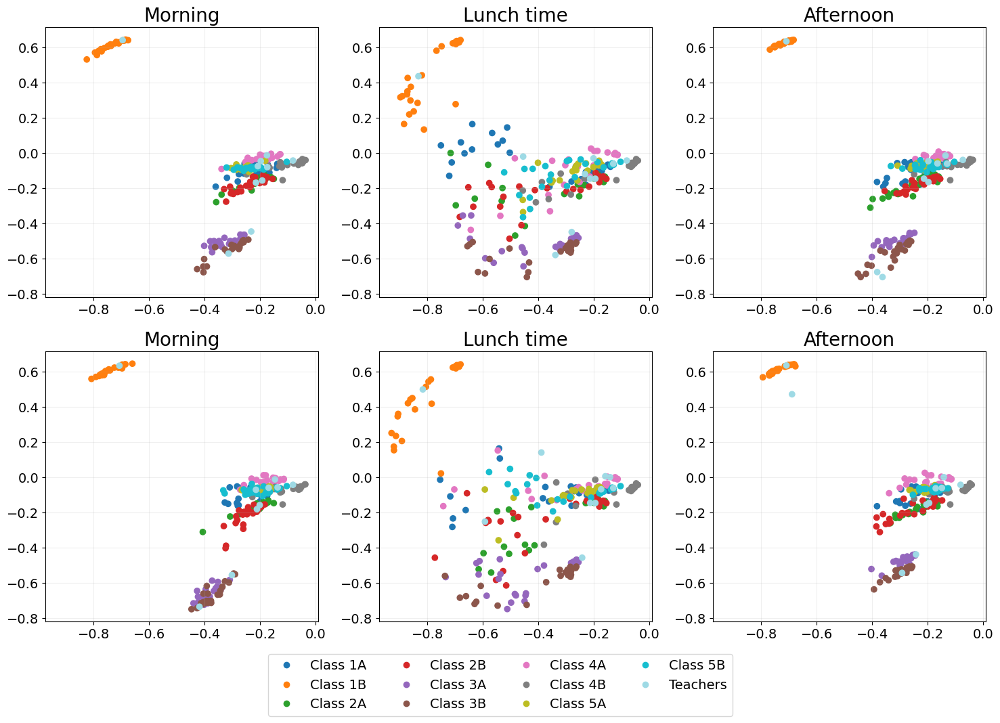

Lyon school graph
=================

.. code:: ipython3

    import matplotlib.pyplot as plt
    import numpy as np
    import pandas as pd
    
    from scipy import sparse
    from scipy.sparse.linalg import svds
    from scipy import linalg
    
    import pyemb as eb

.. code:: ipython3

    np.random.seed(42)

Load dataset
~~~~~~~~~~~~

.. code:: ipython3

    window = 15*60
    
    day_1_start = (8*60+30)*60
    day_1_end = (17*60+30)*60
    day_2_start = ((24+8)*60+30)*60
    day_2_end = ((24+17)*60+30)*60
    
    T1 = int((day_1_end - day_1_start) // window)
    T2 = int((day_2_end - day_2_start) // window)
    T = T1 + T2
    
    print(f'Number of time windows: {T}')
    
    fname = 'data/ia-primary-school-proximity-attr.edges'
    file = open(fname)
    
    nodes = []
    node_labels = []
    edge_tuples = []
    
    for line in file:
        node_i, node_j, time, id_i, id_j = line.strip('\n').split(',')
        
        if day_1_start <= int(time) < day_1_end:
            t = (int(time) - day_1_start) // window
        elif day_2_start <= int(time) < day_2_end:
            t = T1 + (int(time) - day_2_start) // window
        else:
            continue
        
        if node_i not in nodes:
            nodes.append(node_i)
            if id_i != "Teachers":
                id_i = "Class " + id_i
            node_labels.append(id_i)
        
        if node_j not in nodes:
            nodes.append(node_j)
            if id_j != "Teachers":
                id_j = "Class " + id_j
            node_labels.append(id_j)
        
        edge_tuples.append([t, node_i, node_j])
        
    edge_tuples = np.unique(edge_tuples, axis=0)
    nodes = np.array(nodes)
    
    n = len(nodes)
    print(f'Number of nodes: {n}')
    
    node_dict = dict(zip(nodes[np.argsort(node_labels)], range(n)))
    node_labels = np.sort(node_labels)
    
    As = []
    for t in range(T):
        idx = np.where(edge_tuples[:, 0] == str(t))[0]
        A = sparse.coo_matrix((np.ones(len(idx)), ([node_dict[edge_tuples[i, 1]] for i in idx], [node_dict[edge_tuples[i, 2]] for i in idx])), shape=(n,n))
        As.append((A + A.T).sign())

.. parsed-literal::

    Number of time windows: 72
    Number of nodes: 242

Embed the dynamic network
~~~~~~~~~~~~~~~~~~~~~~~~~

.. code:: ipython3

    
    # Embed the graph using unfolded regularised Laplacian spectral embedding
    d = 10
    URLSE_emb = eb.dyn_embed(As, d=d, method="URLSE")

Quick visualisations
--------------------

A quick interactive and animated plot to explore your embedding
~~~~~~~~~~~~~~~~~~~~~~~~~~~~~~~~~~~~~~~~~~~~~~~~~~~~~~~~~~~~~~~

Click
`here <https://edwarddavis1.github.io/example_pyemb_quick_plot/>`__ to
view an example of the interactive output of ``quick_plot()``.

.. code:: ipython3

    # Quick interactive + animated plot of the embedding
    fig = eb.quick_plot(URLSE_emb, n, T, node_labels)

Visualise embedding time point snapshots of interest
~~~~~~~~~~~~~~~~~~~~~~~~~~~~~~~~~~~~~~~~~~~~~~~~~~~~

.. code:: ipython3

    URLSE_emb = eb.dyn_embed(As, d=d, method="URLSE", flat=False)
    
    # Select snapshots to be shown
    points_of_interest = [5, 14]
    point_labels = ["Class time", "Lunch time"]
    
    # Plot the snapshots
    fig = eb.snapshot_plot(
        URLSE_emb, 
        n, 
        node_labels, 
        points_of_interest, 
        point_labels, 
        add_legend=True, 
        legend_adjust=-0.1, # adjust the vertical height of the legend
        cmap="tab20"
    )
    
    # Apply any further adjustments to the plot
    _ = fig.suptitle("URLSE")

Degree-correct the embedding
~~~~~~~~~~~~~~~~~~~~~~~~~~~~

.. code:: ipython3

    URLSE_emb_dc = eb.degree_correction(URLSE_emb)
    URLSE_fig = eb.snapshot_plot(
        URLSE_emb_dc, 
        n, 
        node_labels, 
        points_of_interest, 
        point_labels, 
        add_legend=True, 
        legend_adjust=-0.1,
        cmap="tab20"
    )
    _ = URLSE_fig.suptitle("URLSE with degree correction")

Compare embedding methods
-------------------------

Independent spectral embedding
~~~~~~~~~~~~~~~~~~~~~~~~~~~~~~

A naive dynamic embedding method where each adjacency matrix is embedded
independently using spectral embedding.

As each time point is entirely independent temporal structure is lost,
which is illustrated by no two time points looking at all alike.

.. code:: ipython3

    ISE_emb = eb.dyn_embed(As, d, method="ISE")
    ISE_emb = eb.degree_correction(ISE_emb)
    
    points_of_interest = [5, 14, 27, 41, 50, 63]
    point_labels = ["Morning", "Lunch time", "Afternoon"] * 2
    
    # Adjust the text size on the plot
    plt.rcParams.update({'font.size': 14})
    
    ISE_fig = eb.snapshot_plot(
        ISE_emb, 
        n, 
        node_labels, 
        points_of_interest, 
        point_labels, 
        max_cols=3,     # maximum number of columns in the plot
        add_legend=True, 
        legend_adjust=-0.1,
        
        # Apply other matplotlib settings
        cmap="tab20",
        s=70,
    )
    plt.tight_layout()

Omnibus embedding (OMNI)
~~~~~~~~~~~~~~~~~~~~~~~~

The OMNI embedding [1] manages to fix the problem of time points looking
completely different, as shown by classes remaining in similar places
across all time points.

However, at lunchtime we expect classes to mix, children play with
children from other classes at lunch time. OMNI fails to show this
mixing as (e.g. the orange class clearly does not mix).

[1] Levin, Keith, et al. “A central limit theorem for an omnibus
embedding of multiple random dot product graphs.” 2017 IEEE
international conference on data mining workshops (ICDMW). IEEE, 2017.

.. code:: ipython3

    OMNI_emb = eb.dyn_embed(As, d, method="OMNI")
    OMNI_emb = eb.degree_correction(OMNI_emb)
    
    points_of_interest = [5, 14, 27, 41, 50, 63]
    point_labels = ["Morning", "Lunch time", "Afternoon"] * 2
    
    OMNI_fig = eb.snapshot_plot(
        OMNI_emb, 
        n, 
        node_labels, 
        points_of_interest, 
        point_labels, 
        max_cols=3,     # maximum number of columns in the plot
        add_legend=True, 
        legend_adjust=-0.1,
        
        # Apply other matplotlib settings
        cmap="tab20",
        s=70,
    )
    plt.tight_layout()

UASE
~~~~

Unfoled adjacency spectral embedding (UASE) [2, 3] was the first of a
suite of “unfolded” dynamic embedding methods. Owing to its property of
stability [3], UASE is able to show both the clustering of classes in
classtime as well as the total mixing of classes at lunchtime.

[2] Jones, Andrew, and Patrick Rubin-Delanchy. “The multilayer random
dot product graph.” arXiv preprint arXiv:2007.10455 (2020).

[3] Gallagher, Ian, Andrew Jones, and Patrick Rubin-Delanchy. “Spectral
embedding for dynamic networks with stability guarantees.” Advances in
Neural Information Processing Systems 34 (2021): 10158-10170.

.. code:: ipython3

    UASE_emb = eb.dyn_embed(As, d, method="UASE")
    UASE_emb = eb.degree_correction(UASE_emb)
    
    points_of_interest = [5, 14, 27, 41, 50, 63]
    point_labels = ["Morning", "Lunch time", "Afternoon"] * 2
    
    UASE_fig = eb.snapshot_plot(
        UASE_emb, 
        n, 
        node_labels, 
        points_of_interest, 
        point_labels, 
        max_cols=3,     # maximum number of columns in the plot
        add_legend=True, 
        legend_adjust=-0.1,
        
        # Apply other matplotlib settings
        cmap="tab20",
        s=70,
    )
    plt.tight_layout()

URLSE
~~~~~

Unfolded regularised Laplacian spectral embedding (URLSE) is essentially
a regularised version of UASE. URLSE is one of many possible unfolded
dynamic embedding, all of which feature stability properties [4]. This
means that, like UASE, this method is able to display the clustering of
classes in classtime and the mixing of classes at lunchtime.

[4] Ed Davis, Ian Gallagher, Daniel John Lawson, and Patrick
Rubin-Delanchy. A simple and powerful framework for stable dynamic
network embedding. arXiv preprint arXiv:2311.09251, 2023.

.. code:: ipython3

    URLSE_emb = eb.dyn_embed(As, d, method="URLSE")
    URLSE_emb = eb.degree_correction(URLSE_emb)
    
    points_of_interest = [5, 14, 27, 41, 50, 63]
    point_labels = ["Morning", "Lunch time", "Afternoon"] * 2
    
    URLSE_fig = eb.snapshot_plot(
        URLSE_emb, 
        n, 
        node_labels, 
        points_of_interest, 
        point_labels, 
        max_cols=3,     # maximum number of columns in the plot
        add_legend=True, 
        legend_adjust=-0.1,
        
        # Apply other matplotlib settings
        cmap="tab20",
        s=70,
    )
    plt.tight_layout()

