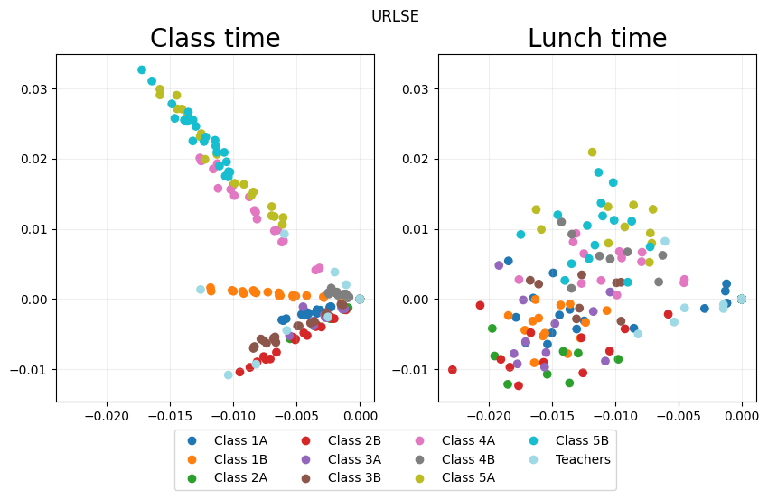
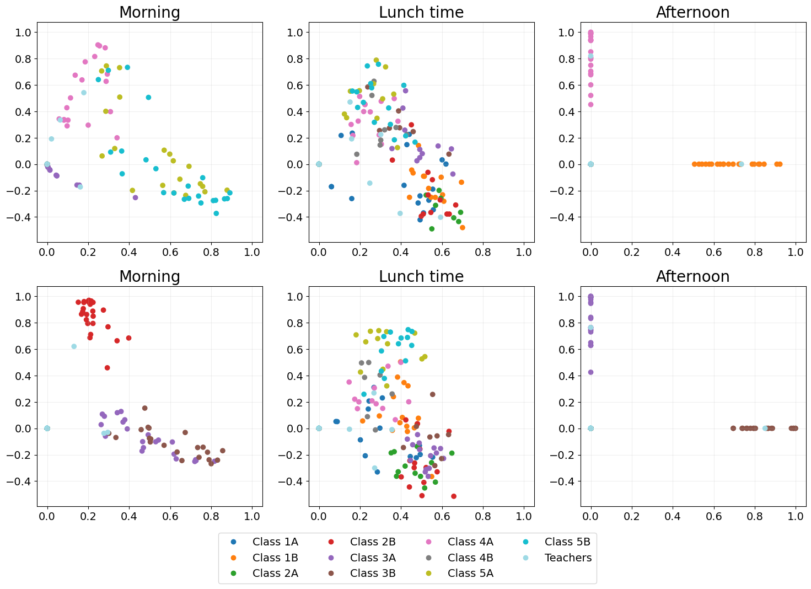
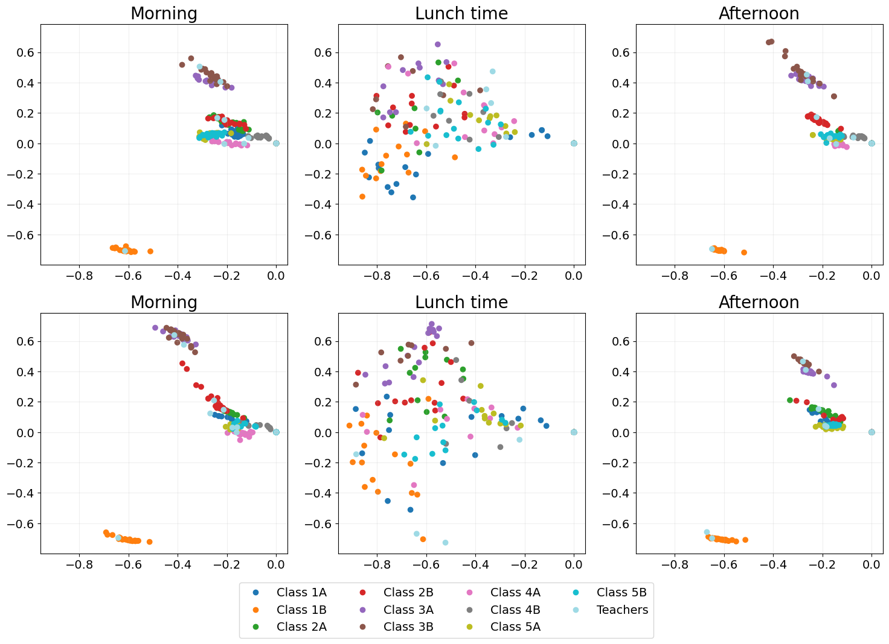
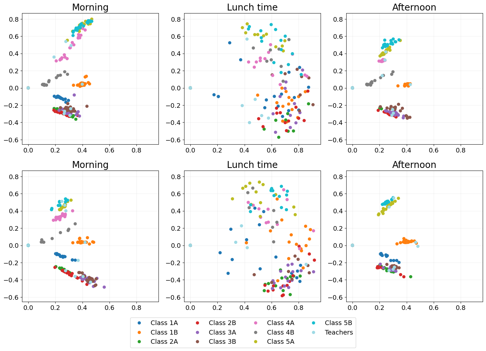

School contact graph
====================

This tutorial aims to explore the different methods to embed a dynamic
network (URLSE, ISE, OMNI and UASE). To do this, we use a `temporal
network <http://www.sociopatterns.org/datasets/primary-school-temporal-network-data/>`__
of contacts between the children and teachers in a French school.

Load dataset
------------

.. code:: ipython3

    data = eb.load_lyon()
    
    edge_tuples = data['data']
    node_labels = data['labels']

.. parsed-literal::

    Data loaded successfully

``edge_tuples`` contains an array with three columns, the first column
is time and the second and third columns are the nodes. The nodes are
indicated by integers from 0, with the label of corresponding index
giving their class (or ``Teachers``).

.. code:: ipython3

    n = node_labels.shape[0]
    T = np.unique(edge_tuples[:,0]).shape[0]
    
    print(f'Number of nodes: {n}')
    print(f'Number of time windows: {T}')

.. parsed-literal::

    Number of nodes: 242
    Number of time windows: 71

Transform the edge list into a list of matrices.

.. code:: ipython3

    As = []
    for t in range(T):
        idx = np.where(edge_tuples[:, 0] == str(t))[0]
        A = sparse.coo_matrix((np.ones(len(idx)), ([edge_tuples[i, 1] for i in idx], [edge_tuples[i, 2] for i in idx])), shape=(n,n))
        As.append((A + A.T).sign())

Embed the dynamic network
~~~~~~~~~~~~~~~~~~~~~~~~~

.. code:: ipython3

    # Embed the graph using unfolded regularised Laplacian spectral embedding
    d = 10
    URLSE_emb = eb.dyn_embed(As, d=d, method="URLSE")

Quick visualisations
--------------------

A quick interactive and animated plot to explore your embedding
~~~~~~~~~~~~~~~~~~~~~~~~~~~~~~~~~~~~~~~~~~~~~~~~~~~~~~~~~~~~~~~

Click
`here <https://edwarddavis1.github.io/example_pyemb_quick_plot/>`__ to
view an example of the interactive output of ``quick_plot()``.

.. code:: ipython3

    # Quick interactive + animated plot of the embedding
    # fig = eb.quick_plot(URLSE_emb, n, T, node_labels)

Visualise embedding time point snapshots of interest
~~~~~~~~~~~~~~~~~~~~~~~~~~~~~~~~~~~~~~~~~~~~~~~~~~~~

.. code:: ipython3

    URLSE_emb = eb.dyn_embed(As, d=d, method="URLSE", flat=False)
    
    # Select snapshots to be shown
    points_of_interest = [5, 14]
    point_labels = ["Class time", "Lunch time"]
    
    # Plot the snapshots
    URLSE_fig = eb.snapshot_plot(
        URLSE_emb, 
        node_labels = node_labels, 
        idx_of_interest = points_of_interest, 
        title = point_labels, 
        sharex = True,
        sharey = True,
        tick_labels = True,
        add_legend=True, 
        cmap="tab20"   
    )
    
    # Apply any further adjustments to the plot
    _ = URLSE_fig.suptitle("URLSE")

Degree-correct the embedding
~~~~~~~~~~~~~~~~~~~~~~~~~~~~

.. code:: ipython3

    URLSE_emb_dc = eb.degree_correction(URLSE_emb)
    URLSE_fig = eb.snapshot_plot(
        URLSE_emb_dc, 
        node_labels = node_labels, 
        idx_of_interest = points_of_interest, 
        title = point_labels, 
        sharex = True,
        sharey = True,
        tick_labels = True,
        add_legend=True, 
        cmap="tab20"   
    )
    
    _ = URLSE_fig.suptitle("URLSE with degree correction")

.. image:: lyon_files/lyon_16_0.png

Compare embedding methods
-------------------------

Independent spectral embedding
~~~~~~~~~~~~~~~~~~~~~~~~~~~~~~

A naive dynamic embedding method where each adjacency matrix is embedded
independently using spectral embedding.

As each time point is entirely independent temporal structure is lost,
which is illustrated by no two time points looking at all alike.

.. code:: ipython3

    ISE_emb = eb.dyn_embed(As, d, method="ISE")
    ISE_emb = eb.degree_correction(ISE_emb)
    
    points_of_interest = [5, 14, 27, 41, 50, 63]
    point_labels = ["Morning", "Lunch time", "Afternoon"] * 2
    
    # Adjust the text size on the plot
    plt.rcParams.update({'font.size': 14})
    
    ISE_fig = eb.snapshot_plot(
        ISE_emb, 
        n= n,
        node_labels = node_labels, 
        idx_of_interest = points_of_interest, 
        title = point_labels,
        max_cols=3, 
        sharex = True,
        sharey = True,
        tick_labels = True,
        add_legend=True, 
        cmap="tab20"   
    )
    plt.tight_layout()

.. code:: ipython3

    ISE_emb = eb.dyn_embed(As, d, method="ISE")
    ISE_emb = eb.degree_correction(ISE_emb)
    
    points_of_interest = [5, 14, 27, 41, 50, 63]
    point_labels = ["Morning", "Lunch time", "Afternoon"] * 2
    
    # Adjust the text size on the plot
    plt.rcParams.update({'font.size': 14})
    
    ISE_fig = eb.snapshot_plot(
        ISE_emb, 
        n= n,
        node_labels = node_labels, 
        idx_of_interest = points_of_interest, 
        title = point_labels,
        max_cols=3, 
        sharex = True,
        sharey = True,
        tick_labels = True,
        add_legend=True, 
        cmap="tab20"   
    )
    
    plt.tight_layout()

.. image:: lyon_files/lyon_20_0.png

Omnibus embedding (OMNI)
~~~~~~~~~~~~~~~~~~~~~~~~

The OMNI embedding `Levin et al.,
2017 <https://ieeexplore.ieee.org/abstract/document/8215766?casa_token=A8Vz_qKy3WoAAAAA:TcmJnZtU85qQGJCSTh765-qZnj_carcslkH_ZgRl6U1ffI7YvcDF8wtrGfWhImw-GO8O0OT0-pp5>`__
manages to fix the problem of time points looking completely different,
as shown by classes remaining in similar places across all time points.

However, at lunchtime we expect classes to mix, children play with
children from other classes at lunch time. OMNI fails to show this
mixing as (e.g. the orange class clearly does not mix).

.. code:: ipython3

    OMNI_emb = eb.dyn_embed(As, d, method="OMNI")
    OMNI_emb = eb.degree_correction(OMNI_emb)
    
    points_of_interest = [5, 14, 27, 41, 50, 63]
    point_labels = ["Morning", "Lunch time", "Afternoon"] * 2
    
    OMNI_fig = eb.snapshot_plot(
        OMNI_emb, 
        n= n,
        node_labels = node_labels, 
        idx_of_interest = points_of_interest, 
        title = point_labels,
        max_cols=3, 
        sharex = True,
        sharey = True,
        tick_labels = True,
        add_legend=True, 
        cmap="tab20"   
    )
    plt.tight_layout()

.. image:: lyon_files/lyon_22_0.png

UASE
~~~~

Unfoled adjacency spectral embedding (UASE) `Jones et al.,
2020 <https://arxiv.org/abs/2007.10455>`__, `Gallagher et al.,
2021 <https://proceedings.neurips.cc/paper/2021/hash/5446f217e9504bc593ad9dcf2ec88dda-Abstract.html>`__
was the first of a suite of “unfolded” dynamic embedding methods. Owing
to its property of stability, UASE is able to show both the clustering
of classes in classtime as well as the total mixing of classes at
lunchtime.

.. code:: ipython3

    UASE_emb = eb.dyn_embed(As, d, method="UASE")
    UASE_emb = eb.degree_correction(UASE_emb)
    
    points_of_interest = [5, 14, 27, 41, 50, 63]
    point_labels = ["Morning", "Lunch time", "Afternoon"] * 2
    
    UASE_fig = eb.snapshot_plot(
        UASE_emb, 
        n= n,
        node_labels = node_labels, 
        idx_of_interest = points_of_interest, 
        title = point_labels,
        max_cols=3, 
        sharex = True,
        sharey = True,
        tick_labels = True,
        add_legend=True, 
        cmap="tab20" 
    )
    plt.tight_layout()

URLSE
~~~~~

Unfolded regularised Laplacian spectral embedding (URLSE) is essentially
a regularised version of UASE. URLSE is one of many possible unfolded
dynamic embedding, all of which feature stability properties `Davis et
al., 2023 <https://arxiv.org/abs/2311.09251>`__. This means that, like
UASE, this method is able to display the clustering of classes in
classtime and the mixing of classes at lunchtime.

.. code:: ipython3

    URLSE_emb = eb.dyn_embed(As, d, method="URLSE")
    URLSE_emb = eb.degree_correction(URLSE_emb)
    
    points_of_interest = [5, 14, 27, 41, 50, 63]
    point_labels = ["Morning", "Lunch time", "Afternoon"] * 2
    
    URLSE_fig = eb.snapshot_plot(
        URLSE_emb, 
        n= n,
        node_labels = node_labels, 
        idx_of_interest = points_of_interest, 
        title = point_labels,
        max_cols=3, 
        sharex = True,
        sharey = True,
        tick_labels = True,
        add_legend=True, 
        cmap="tab20" 
    )
    plt.tight_layout()

References
------------

-  Levin, K., Athreya, A., Tang, M., Lyzinski, V. and Priebe, C.E.,
   2017, November. A central limit theorem for an omnibus embedding of
   multiple random dot product graphs. In 2017 IEEE international
   conference on data mining workshops (ICDMW) (pp. 964-967). IEEE.

-  Jones, A. and Rubin-Delanchy, P., 2020. The multilayer random dot
   product graph. arXiv preprint arXiv:2007.10455.

-  Gallagher, I., Jones, A. and Rubin-Delanchy, P., 2021. Spectral
   embedding for dynamic networks with stability guarantees. Advances in
   Neural Information Processing Systems, 34, pp.10158-10170.

-  Davis, E., Gallagher, I., Lawson, D.J. and Rubin-Delanchy, P., 2023.
   A simple and powerful framework for stable dynamic network embedding.
   arXiv preprint arXiv:2311.09251.
