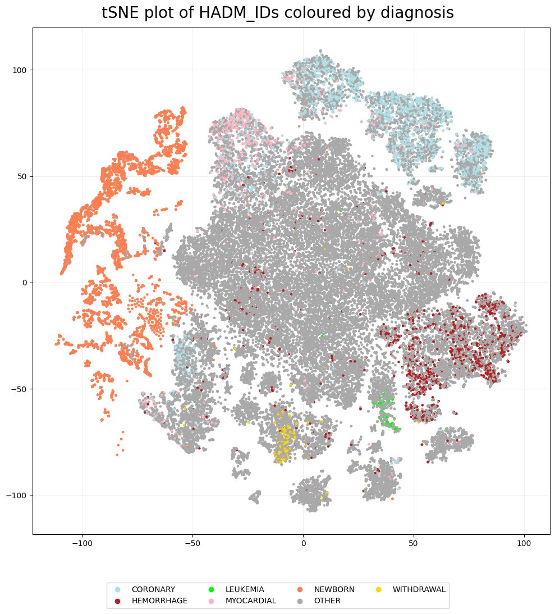

MIMIC-III
=========

Here, we demonstrate functionality related to multipartite graphs
`Modell et al., 2022 <https://arxiv.org/abs/2202.03945>`__ – a natural
way to explore relational databases. We use
`MIMIC-III <https://physionet.org/content/mimiciii/1.4/>`__ which is a
relational database of heath-related data of patients at critical care
units of a medical center between 2001-2012.

Unlike the other examples, the data cannot be shared directly. Users can
apply for access to the database
`here <https://mimic.mit.edu/docs/gettingstarted/>`__ and a smaller open
access version can be found
`here <https://physionet.org/content/mimiciii-demo/1.4/>`__.

The files we use here are: ``ADMISSIONS.csv``, ``LABEVENTS.csv``,
``MICROBIOLOGY.csv`` and ``PRESCRIPTIONS.csv``. These files all contain
the associated hospital admission ID (``HADM_ID``) which we use to
create a network. Within the admissions file, all the hospital
admissions have a diagnosis associated with them which we use as labels.

Data load
~~~~~~~~~

.. code:: ipython3

    joining_col = 'HADM_ID'
    data_names = ['micro', 'lab', 'pre']
    dfs = {name: pd.read_csv('data/' + name + '.csv') for name in data_names}

.. parsed-literal::

    /tmp/ipykernel_38409/1342678660.py:3: DtypeWarning: Columns (11) have mixed types. Specify dtype option on import or set low_memory=False.
      dfs = {name: pd.read_csv('data/' + name + '.csv') for name in data_names}

Create a dictionary of hospital admission IDs to diagnoses.

.. code:: ipython3

    adm = pd.read_csv('data/adm.csv')
    hadm_to_diag = dict(zip(adm[joining_col], adm['DIAGNOSIS']))
    hadm_to_diag = {str(k): v for k, v in hadm_to_diag.items()}

Create a multipartite graph where we have links between hospital
admission IDs and organism IDs, lab items and drugs.

This creates a a large matrix where each unique entity in each parition
has a row and a column.

.. code:: ipython3

    pairs = [[joining_col, 'ORG_ITEMID'], [joining_col,
                                           'ITEMID'], [joining_col, 'FORMULARY_DRUG_CD']]
    
    A, attributes = eb.graph_from_dataframes(list(dfs.values()), pairs)

.. parsed-literal::

    3it [00:03,  1.18s/it]

To create the matrix with hospital admissions as the rows and organism,
lab and drug IDs as the columns, we use the ``find_subgraph`` functions.

This takes in a list (of two lists), the first containing the attributes
of items we want in the rows, here we want partition ``HADM_ID``, and
the second we have the attributes we want in the columns, that is the
partitions ``ORG_ITEMID``, ``FORMULARY_DRUG_CD`` and ``ITEMID``.

.. code:: ipython3

    sub_attr = [
        [{'partition': joining_col}],
        [{'partition': 'ORG_ITEMID'}, {'partition': 'ITEMID'},
            {'partition': 'FORMULARY_DRUG_CD'}]
    ]
    subgraph_A, subgraph_attributes = eb.find_subgraph(A, attributes, sub_attr)

.. code:: ipython3

    print('Number of rows:', subgraph_A.shape[0])

.. parsed-literal::

    Number of rows: 57709

For computational reasons we calculate the dimension on a sample of the
data.

.. code:: ipython3

    n = 10000  
    random_rows = np.random.choice(subgraph_A.shape[0], n, replace=False) 
    sample_subgraph_A = subgraph_A[random_rows, :]
    
    Y = eb.embed(sample_subgraph_A, d=100, version='full')
    ws, dim = eb.wasserstein_dimension_select(Y, range(50), split=0.5)
    print("Selected dimension: {}".format(dim))

.. parsed-literal::

    /home/ag16115/Documents/phd/pyemb/pyemb/embedding.py:129: UserWarning: Warning: More than one connected component in the graph.
      warnings.warn("Warning: More than one connected component in the graph.")
    100%|██████████| 50/50 [03:30<00:00,  4.20s/it]

.. parsed-literal::

    Recommended dimension: 21, Wasserstein distance 3.77451
    Selected dimension: 21

.. code:: ipython3

    le = eb.embed(subgraph_A, dim, make_laplacian=True, regulariser= 'auto')

Perform tSNE

.. code:: ipython3

    from sklearn.manifold import TSNE
    tsne = TSNE(n_components=2)
    tsne = tsne.fit_transform(le)

Next, we can see if the tSNE plot shows any clustering related to the
diagnoses. The labels are quite messy, with over 3000 unique diagnoses,
so instead we colour based on whether a diagnosis contains one of the
following words: withdrawal, hemorrhage, coronary, leukemia or newborn.

These points will be coloured according to ``labels_to_colour``, all
others are grey.

.. code:: ipython3

    split_labels = [subgraph_attributes[0][i]['name'].split('::')[1] for i in range(subgraph_A.shape[0])]
    labels = [str(hadm_to_diag[a]) for a in split_labels]
    labels_to_colour = {'WITHDRAWAL': 'gold', 'MYOCARDIAL': 'lightpink', 'HEMORRHAGE': 'firebrick', 'CORONARY': 'powderblue', 'LEUKEMIA': 'lime', 'NEWBORN': 'coral', 'OTHER': 'darkgrey'}
    
    keywords = list(labels_to_colour.keys())
    plot_labels  = [
        next((keyword for keyword in keywords if keyword in label), None)
        if any(keyword in label for keyword in keywords) else 'OTHER'
        for label in labels]
    plot_colours = [labels_to_colour[label] for label in plot_labels]

.. code:: ipython3

    pca_fig = eb.snapshot_plot(
        embedding = tsne, 
        node_labels = plot_labels, 
        c = plot_colours,
        tick_labels = True,
        add_legend = True, 
        title = 'tSNE plot of HADM_IDs coloured by diagnosis',
        # Apply other matplotlib settings
        figsize = (10, 10),
        s=5,
    )
    plt.tight_layout()

Therefore, it is clear we see some clustering based on diagnosis. It is
worth noting that while coronary and myocardial have quite a large
overlap, these words both relate to problems with the heart.

References
------------

-  Modell, A., Gallagher, I., Cape, J. and Rubin-Delanchy, P., 2022.
   Spectral embedding and the latent geometry of multipartite networks.
   arXiv preprint arXiv:2202.03945.
