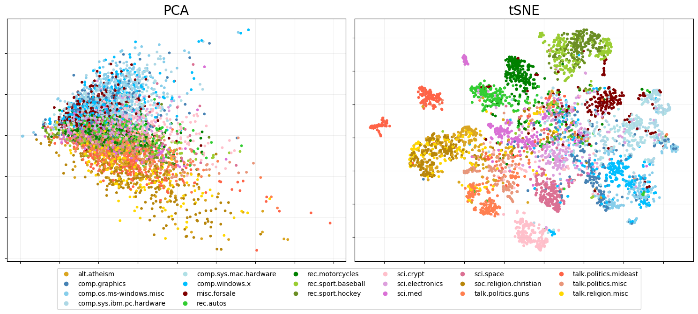
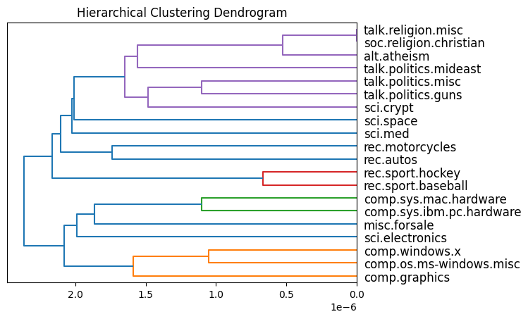
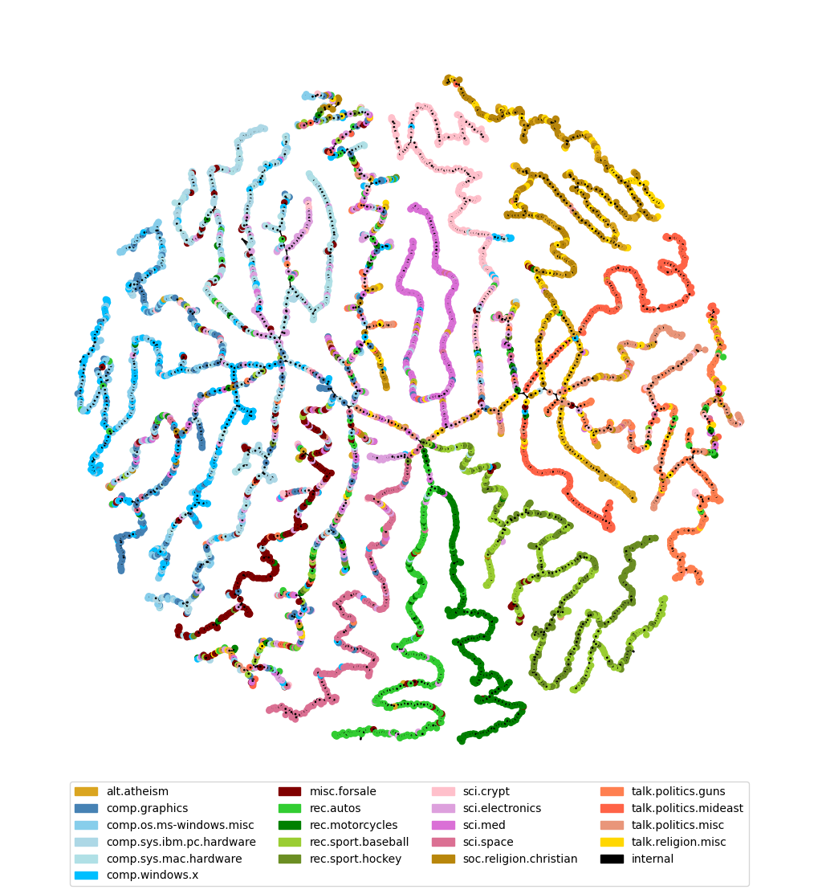

20Newsgroup documents
=====================

This sections aims to use the packages functionality on text data. This
includes creating a amtrix of tf-idf features, PCA and hierarchical
clustering. For this, we will demonstrate on a sample of the
`20Newsgroup data <https://qwone.com/~jason/20Newsgroups/>`__. Each
document is associated with 1 of 20 newsgroup topics, organized at two
hierarchical levels.

Data load
---------

Import data and create dataframe.

.. code:: ipython3

    df = eb.load_newsgroup()

.. parsed-literal::

    Data loaded successfully

``eb.text_matrix_and_attributes`` - creates a Y matrix of tf-idf
features. It takes in a dataframe and the column which contains the
data. Further functionality includes: removing general stopwords, adding
stopwords, removing email addresses, cleaning (lemmatize and remove
symbol, lowercase letters) and a threshold for the min/max number of
documents a word needs to appear in to be included.

.. code:: ipython3

    Y, attributes = eb.text_matrix_and_attributes(df, 'data', remove_stopwords=True, clean_text=True,
                                        remove_email_addresses=True, update_stopwords=['subject'],
                                        min_df=5, max_df=len(df)-1000)

.. code:: ipython3

    (n,p) = Y.shape
    print("n = {}, p = {}".format(n,p))

.. parsed-literal::

    n = 5000, p = 12804

Perform dimension selection using Wasserstein distances, see `Whiteley
et al., 2022 <https://arxiv.org/pdf/2208.11665>`__ for details.

.. code:: ipython3

    ws, dim = eb.wasserstein_dimension_select(Y, range(40), split=0.5)

.. code:: ipython3

    print("Selected dimension: {}".format(dim))

.. parsed-literal::

    Selected dimension: 28

PCA and tSNE
------------

Now we perform PCA `Whiteley et al.,
2022 <https://arxiv.org/pdf/2208.11665>`__.

.. code:: ipython3

    zeta = p**-.5 * eb.embed(Y, d=dim, version='full')

Apply t-SNE.

.. code:: ipython3

    from sklearn.manifold import TSNE
    
    tsne_zeta = TSNE(n_components=2, perplexity=30).fit_transform(zeta)

Colours dictionary where topics from the same theme have different
shades of the same colour

.. code:: ipython3

    target_colour = {'alt.atheism': 'goldenrod',
                     'comp.graphics': 'steelblue',
                     'comp.os.ms-windows.misc': 'skyblue',
                     'comp.sys.ibm.pc.hardware': 'lightblue',
                     'comp.sys.mac.hardware': 'powderblue',
                     'comp.windows.x': 'deepskyblue',
                     'misc.forsale': 'maroon',
                     'rec.autos': 'limegreen',
                     'rec.motorcycles': 'green',
                     'rec.sport.baseball': 'yellowgreen',
                     'rec.sport.hockey': 'olivedrab',
                     'sci.crypt': 'pink',
                     'sci.electronics': 'plum',
                     'sci.med': 'orchid',
                     'sci.space': 'palevioletred',
                     'soc.religion.christian': 'darkgoldenrod',
                     'talk.politics.guns': 'coral',
                     'talk.politics.mideast': 'tomato',
                     'talk.politics.misc': 'darksalmon',
                     'talk.religion.misc': 'gold'}

Plot PCA on the LHS and PCA + t-SNE on the RHS

.. code:: ipython3

    pca_fig = eb.snapshot_plot(
        embedding = [zeta[:, :2],tsne_zeta], 
        node_labels = df['target_names'].tolist(), 
        c = target_colour,
        title = ['PCA','tSNE'],
        
        add_legend=True, 
        max_legend_cols = 6,
        figsize = (15,6),
        move_legend = (.5,-.15),
        # tick_labels = True, 
        # Apply other matplotlib settings
        s=10,
    )
    plt.tight_layout()

Hierarchical clustering with dot products, `Gray et al., 2024 <https://proceedings.neurips.cc/paper_files/paper/2023/file/6521937507d78f327cd402401be73bf2-Paper-Conference.pdf>`__
-----------------------------------------------------------------------------------------------------------------------------------------------------------------------------------

First we do HC for the centroids of each topic and plot the dendrogram.
Then we do HC on the whole dataset and visualise the output tree.

On centroids
------------

Find centroids

.. code:: ipython3

    idxs = [np.where(np.array(df['target']) == t)[0]
            for t in sorted(df['target'].unique())]
    t_zeta = np.array([np.mean(zeta[idx, :], axis=0) for idx in idxs])

Topic HC clustering

.. code:: ipython3

    t_dp_hc = eb.DotProductAgglomerativeClustering()
    t_dp_hc.fit(t_zeta);

Plot dendrogram

.. code:: ipython3

    plt.title("Hierarchical Clustering Dendrogram")
    eb.plot_dendrogram(t_dp_hc, dot_product_clustering=True, orientation='left',
                       labels=sorted(df['target_names'].unique()))
    plt.show()

On documents
------------

.. code:: ipython3

    dp_hc = eb.DotProductAgglomerativeClustering()
    dp_hc.fit(zeta);

Use construct tree graph from hierarchical clustering, epsilon is set to
zero as we don’t want to prune the tree.

.. code:: ipython3

    tree = eb.ConstructTree(model= dp_hc, epsilon=0)
    tree.fit()

.. parsed-literal::

    Constructing tree...

.. parsed-literal::

    <pyemb.hc.ConstructTree at 0x74ee20fbf280>

.. code:: ipython3

    tree.plot(labels = list(df["target_names"]), colours = target_colour, node_size=25, forceatlas_iter=100)

.. parsed-literal::

    100%|██████████| 100/100 [00:11<00:00,  9.00it/s]

.. parsed-literal::

    BarnesHut Approximation  took  6.12  seconds
    Repulsion forces  took  4.49  seconds
    Gravitational forces  took  0.04  seconds
    Attraction forces  took  0.03  seconds
    AdjustSpeedAndApplyForces step  took  0.20  seconds

References
----------

-  Whiteley, N., Gray, A. and Rubin-Delanchy, P., 2022. Statistical
   exploration of the Manifold Hypothesis.

-  Gray, A., Modell, A., Rubin-Delanchy, P. and Whiteley, N., 2024.
   Hierarchical clustering with dot products recovers hidden tree
   structure. Advances in Neural Information Processing Systems, 36.
