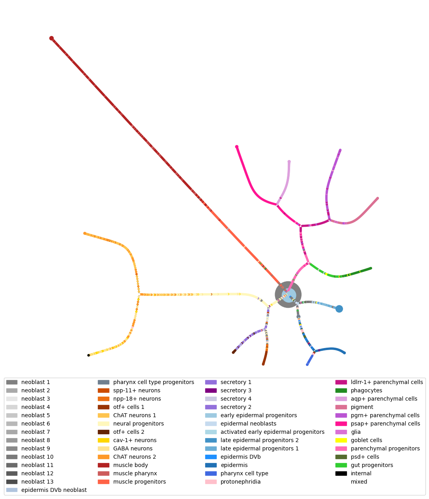

Planaria single-cell
====================

This section uses `data <https://shiny.mdc-berlin.de/psca/>`__ from the
paper `Plass et al.,
2018 <https://www.science.org/doi/abs/10.1126/science.aaq1723>`__. It
contains expression levels of :math:`p= 5821` genes measured across
:math:`n=5000` individual cells from adult planarians, a type of
flatworm. Such data offer the possibility of discovering the cell
lineage tree of an entire animal: the aim is to find out if the data
reflect the tree-structured process by which stem cells differentiate
into a variety of distinct cell types. These data were prepared using
the Python package
`Scanpy <https://scanpy.readthedocs.io/en/stable/index.html>`__, where
the script on how to do this can be found
`here <https://nbviewer.org/github/rajewsky-lab/planarian_lineages/blob/master/paga/preprocessing.ipynb>`__.

Load data
---------

.. code:: ipython3

    data = eb.load_planaria()
    
    Y = data['Y']
    labels = data['labels']
    ordered_cats = data['cell_types']
    colors = data['color_dict']

.. parsed-literal::

    Data loaded successfully

.. code:: ipython3

    (n,p) = Y.shape
    print('Data matrix is', n, 'samples by', p, 'features')

.. parsed-literal::

    Data matrix is 5000 samples by 100 features

Dimension selection and visualisation
-------------------------------------

After selecting the dimension `Whiteley et al.,
2022 <https://arxiv.org/pdf/2208.11665>`__, perform PCA with embedding
function and visualise.

.. code:: ipython3

    ws, dim = eb.wasserstein_dimension_select(Y, range(40), split=0.5)
    print("Selected dimension: {}".format(dim))

.. parsed-literal::

    100%|██████████| 40/40 [01:06<00:00,  1.67s/it]

.. parsed-literal::

    Recommended dimension: 16, Wasserstein distance 0.18280
    Selected dimension: 16

.. code:: ipython3

    zeta = eb.embed(Y, d=14, version='full')

.. code:: ipython3

    ## TSNE
    from sklearn.manifold import TSNE
    tsne = TSNE(n_components=2, perplexity = 30).fit_transform(zeta)

We can plot the two representations of our data with the
``snapshot_plot`` function.

.. code:: ipython3

    pca_fig = eb.snapshot_plot(
        embedding = [zeta[:,:2],tsne], 
        node_labels = labels.tolist(), 
        c = colors,
        title = ['PCA','tSNE'],
        add_legend=True, 
        max_legend_cols = 6,
       figsize = (15,7.5),
       move_legend= (.5,-.3),
        # Apply other matplotlib settings
        s=50,
    )
    plt.tight_layout()

.. image:: planaria_files/planaria_11_0.png

Construct tree
--------------

From here we want to perform hierarchical clustering on the data and
simplify this tree. This can be done using the hierarchical clustering
module.

We use hierarchical clustering with dot products as descibed in `Gray et
al.,
2024 <https://proceedings.neurips.cc/paper_files/paper/2023/file/6521937507d78f327cd402401be73bf2-Paper-Conference.pdf>`__.
This is the default HC in the class ``ConstructTree`` so we can just
give it our point cloud. Otherwise, the HC can be done first and the
model can be given to the ``ConstructTree`` class.

The ``epsilon`` parameter controls the threshold for condensing tree and
if set to zero the full tree will be given.

This can then be plotted. Points are coloured by labels, if a plotted
node is a collection of data points then ``colour_threshold`` controls
when to colour this node by the majority type of data point (colour by
majority if proportion of majority is greater than colour_threshold),
else, if there is no majority node, it is plotted white.

Layouts, node settings and others can also be changed. See the
documentation for details of this.

.. code:: ipython3

    tree = eb.ConstructTree(zeta, epsilon=0.2)
    tree.fit()

.. parsed-literal::

    Performing clustering...
    Calculating branch lengths...
    Constructing tree...

.. parsed-literal::

    <pyemb.hc.ConstructTree at 0x7a1014496170>

.. code:: ipython3

    fig = tree.plot(labels = labels, 
                    colours = colors,
                    add_legend = True, 
                    move_legend = (.5,-.25),
                    prog = 'twopi')

.. parsed-literal::

    100%|██████████| 250/250 [00:03<00:00, 69.38it/s]

.. parsed-literal::

    BarnesHut Approximation  took  2.26  seconds
    Repulsion forces  took  1.08  seconds
    Gravitational forces  took  0.02  seconds
    Attraction forces  took  0.01  seconds
    AdjustSpeedAndApplyForces step  took  0.12  seconds

References
------------

-  Plass, M., Solana, J., Wolf, F.A., Ayoub, S., Misios, A., Glažar, P.,
   Obermayer, B., Theis, F.J., Kocks, C. and Rajewsky, N., 2018. Cell
   type atlas and lineage tree of a whole complex animal by single-cell
   transcriptomics. Science, 360(6391), p.eaaq1723.

-  Whiteley, N., Gray, A. and Rubin-Delanchy, P., 2022. Statistical
   exploration of the Manifold Hypothesis.

-  Gray, A., Modell, A., Rubin-Delanchy, P. and Whiteley, N., 2024.
   Hierarchical clustering with dot products recovers hidden tree
   structure. Advances in Neural Information Processing Systems, 36.
