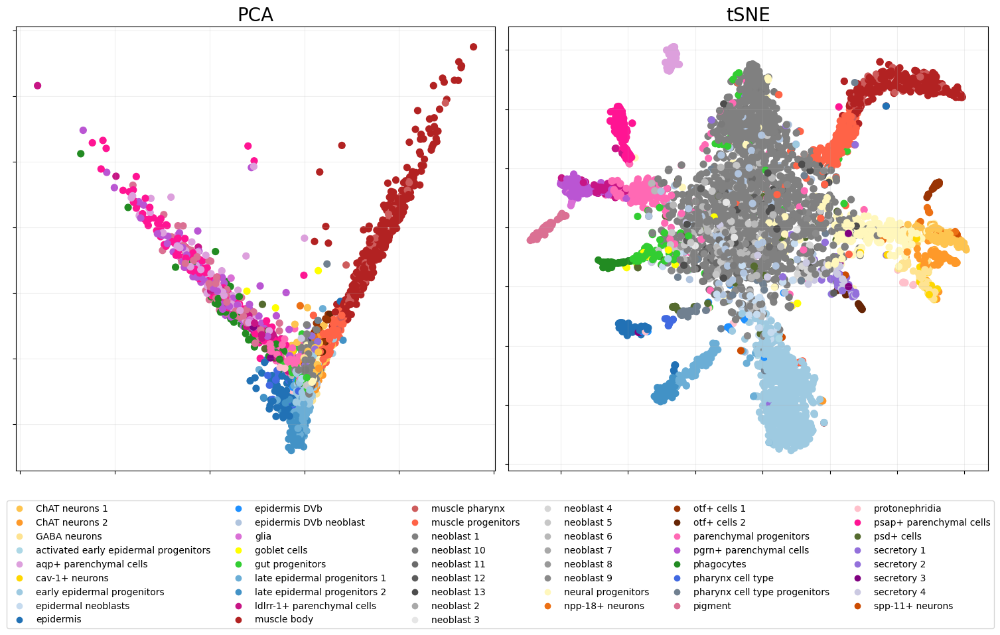

Planaria single-cell
====================

Load data
---------

This section uses `data <https://shiny.mdc-berlin.de/psca/>`__ from the
paper `‘Cell Type Atlas and Lineage Tree of a Whole Complex Animal by
Single-Cell
Transcriptomics’ <https://www.science.org/doi/abs/10.1126/science.aaq1723>`__.
It contains expression levels of :math:`p= 5821` genes measured across
:math:`n=5000` individual cells from adult planarians, a type of
flatworm. Such data offer the possibility of discovering the cell
lineage tree of an entire animal: the aim is to find out if the data
reflect the tree-structured process by which stem cells differentiate
into a variety of distinct cell types. These data were prepared using
the Python package
`Scanpy <https://scanpy.readthedocs.io/en/stable/index.html>`__, where
the script on how to do this can be found
`here <https://nbviewer.org/github/rajewsky-lab/planarian_lineages/blob/master/paga/preprocessing.ipynb>`__.

.. code:: ipython3

    Y = np.array(pd.read_csv('data/planaria_sample_data.csv', index_col=0))
    (n,p) = Y.shape
    print('Data matrix is', n, 'samples by', p, 'features')
    
    labels = np.genfromtxt('data/sample_annotation_5000.txt', delimiter=',', dtype=str) 
    ordered_cats = np.genfromtxt('data/planaria_ordered_cats.csv', delimiter=',', dtype=str)
    
    colors = pd.read_csv('data/colors_dataset.txt', header=None, sep='\t')
    colors = {k: c for k, c in colors.values}

.. parsed-literal::

    Data matrix is 5000 samples by 5821 features

Dimension selection and visualisation
-------------------------------------

Perform dimension selection using Wasserstein distances, as explained in
`‘Statistical exploration of the Manifold
Hypothesis’ <https://arxiv.org/pdf/2208.11665>`__.

.. code:: ipython3

    # ws, dim = eb.wasserstein_dimension_select(Y, range(20), split=0.5)
    # print("Selected dimension: {}".format(dim))
    dim = 14

Now, perform PCA with the embedding function and visualise.

.. code:: ipython3

    zeta = p**-.5 * eb.embed(Y, d=dim, version='full')

.. code:: ipython3

    ## TSNE
    from sklearn.manifold import TSNE
    
    tsne = TSNE(n_components=2, perplexity = 30).fit_transform(zeta)

We can plot the two representations of our data with the
``snapshot_plot`` function

.. code:: ipython3

    pca_fig = eb.snapshot_plot(
        embedding = [zeta[:,:2],tsne], 
        node_labels = labels.tolist(), 
        c = colors,
        title = ['PCA','tSNE'],
        add_legend=True, 
        max_legend_cols = 6,
       figsize = (15,6),
       bbox_to_anchor= (.5,-.35),
        # Apply other matplotlib settings
        s=10,
    )
    plt.tight_layout()

Construct tree
--------------

From here we want to perform hierarchical clustering on the data and
simplify this tree. This can be done using the hierarchical clustering
module.

We use hierarchical clustering with dot products as descibed in
`‘Hierarchical clustering with dot products recovers hidden tree
structure’ <https://proceedings.neurips.cc/paper_files/paper/2023/file/6521937507d78f327cd402401be73bf2-Paper-Conference.pdf>`__.
This is the default HC in the class ``ConstructTree`` so we can just
give it our point cloud. Otherwise, the HC can be done first and the
model can be given to the ``ConstructTree`` class.

The ``epsilon`` parameter controls the threshold for condensing tree and
if set to zero the full tree will be given.

.. code:: ipython3

    tree = eb.ConstructTree(zeta, epsilon=0.2)
    tree.fit()

.. parsed-literal::

    Performing clustering...
    Calculating branch lengths...
    Constructing tree...

.. parsed-literal::

    <pyemb.hc.ConstructTree at 0x754a7014bb50>

This can then be plotted. Points are coloured by labels, if a plotted
node is a collection of data points then ``colour_threshold`` controls
when to colour this node by the majority type of data point (colour by
majority if proportion of majority is greater than colour_threshold),
else, if there is no majority node, it is plotted black.

Layouts, node settings and others can also be changed.

.. code:: ipython3

    fig = tree.plot(labels,colors, prog = 'twopi')

.. parsed-literal::

    100%|██████████| 250/250 [00:03<00:00, 70.96it/s]

.. parsed-literal::

    BarnesHut Approximation  took  2.24  seconds
    Repulsion forces  took  1.05  seconds
    Gravitational forces  took  0.02  seconds
    Attraction forces  took  0.01  seconds
    AdjustSpeedAndApplyForces step  took  0.10  seconds

.. parsed-literal::

    

.. image:: planaria_files/planaria_18_3.png

